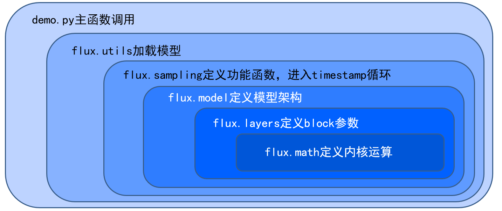
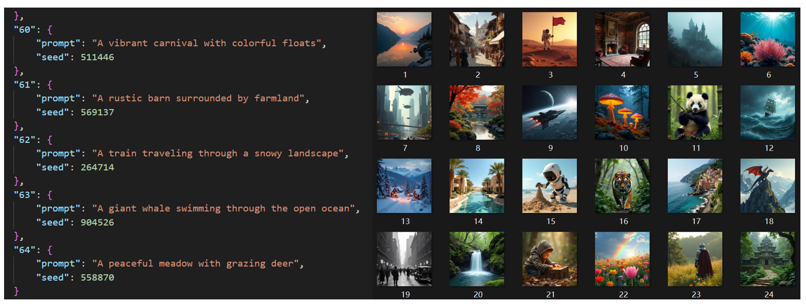
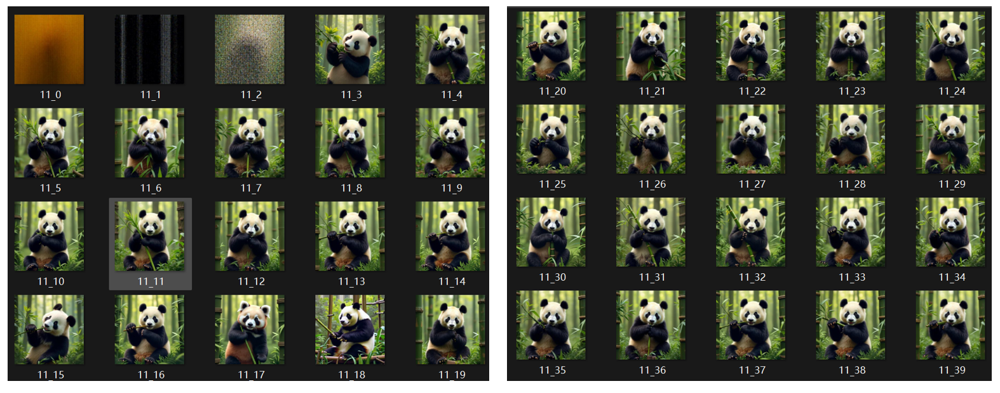
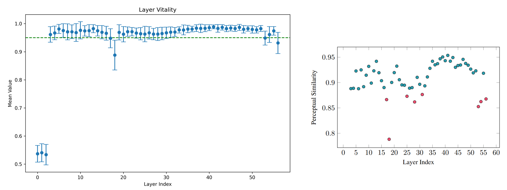
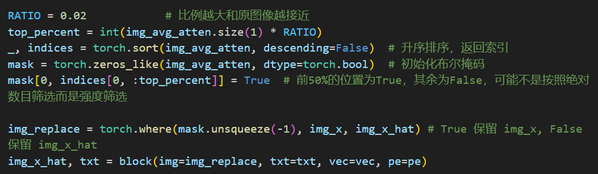
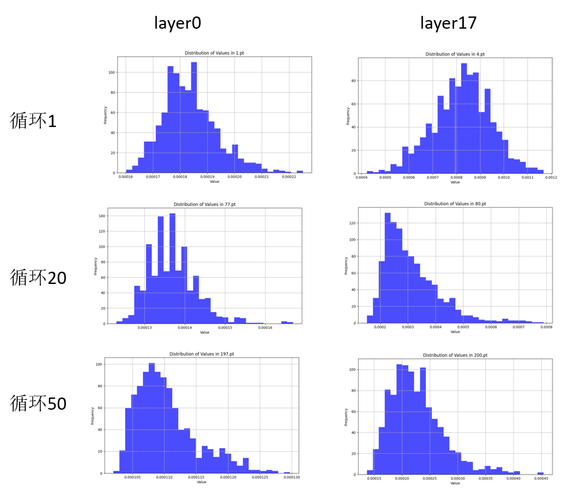
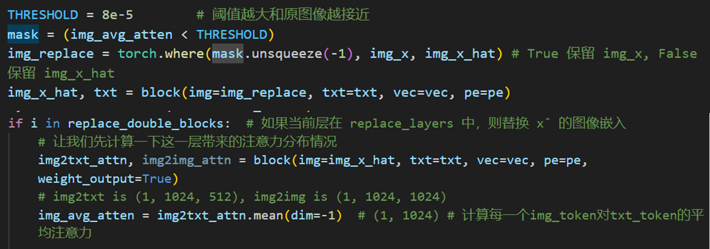
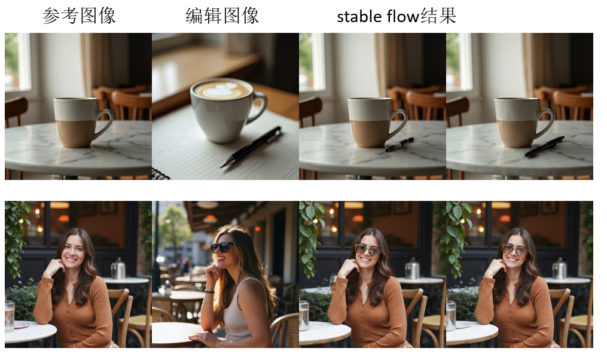
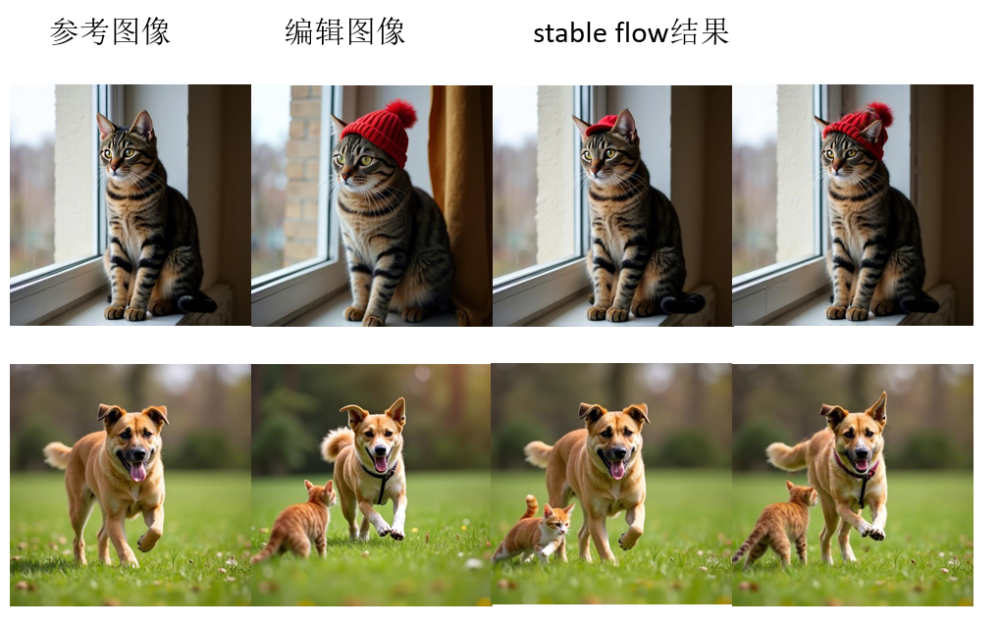

# STABLE FLOW

[toc]

> 基于DiT的Stable Flow模型，构建在FLUX生成模型基础上的稳定编辑方法。

## 配置FLUX

### 配置inference环境

前往[black-forest-labs/flux: Official inference repo for FLUX.1 models](https://github.com/black-forest-labs/flux/tree/main)，将官方的推理库进行clone

使用conda新建一个python=3.10的环境，进入GPU节点，进入环境，进入目录，然后运行`pip install ".[all]"` 

> 在服务器配置环境的时候注意不能使用`pip install -e ".[all]"`命令，否则会默认下载`opencv-python`的包，然后卸载重装`headless`版本依然有问题。
>
> 而是应该使用`pip install ".[all]"`，然后`pip uninstall opencv-python`再进行`pip install opencv-python-headless` 

### 运行示例

然后运行示例`python -m flux --name flux-dev --height 720 --width 1080 --prompt "A pig sitting on a couch"` 

模型可以使用`flux-dev`或者`flux-schnell` 

或者也可以通过gradio进行运行和配置`python demo_gr.py --name flux-dev --device cuda` 

### 配置HuggingFace

> 国内无法直接连接hg的网络，所以需要配置环境变量链接镜像网站：
>
> `export HF_ENDPOINT=https://hf-mirror.com`
>
> 如果模型太大可以更换缓存的存储位置：
>
> `export HF_HOME=<your-path>` 

首次运行会自动下载hugging_face里的dev版本，但是需要先生成token进行身份验证，参考[Command Line Interface (CLI)](https://huggingface.co/docs/huggingface_hub/guides/cli#huggingface-cli-login)，经过漫长的下载过程，后获取示例运行结果。

> 即使是镜像网站也非常慢，1MB/s不到的速度要下载近50GB的数据，大概十几个小时，并且经常断联

但是运行会遇到下面的报错，

```
with safe_open(filename, framework="pt", device=device) as f:
OSError: No such device (os error 19)
```

根据[OSError: No such device (os error 19) · Issue #60 · XLabs-AI/x-flux](https://github.com/XLabs-AI/x-flux/issues/60)的issue，判断是环境变量造成的影响，因此手动下载和配置，精确到具体的safetensor的文件。

根据[black-forest-labs/FLUX.1-dev at main](https://huggingface.co/black-forest-labs/FLUX.1-dev/tree/main)的配置进行下载，同时需要进行`git lfs pull`来下载大文件

> 科学上网后下载速度20MB/s以上，需要下载58GB的数据，不知道配置镜像的速度如何。

### Flux代码结构



从最外围的主函数调用开始，flux.utils需要加载模型名称，到flux.sampling里面的denoise降噪函数调用，flux.model定义的模型调用，flux.layers的具体的Blocks的定义和调用，最后到flux.math的attention内核注意力函数。


## 实现思路

### 关键层识别

通过ChatGPT获取64句提示词，然后生成对应的随机seed，存储到`prompt.json`文件中。

改写`demo_gr.py`，去掉前端界面的显示，并通过读取json文件传递输入参数来实现图像生成。通过读取上一步生成的json文件，可以生成64张参考图像。




然后将denoise的函数进行改写，使其可以跳过某一个特定的层，来实现对模型特定层的消融实验。模型共有57层，一共有64x57=3648张图片生成。

> 参考[CLIP Vs DINOv2 in image similarity | by Jeremy K | 𝐀𝐈 𝐦𝐨𝐧𝐤𝐬.𝐢𝐨 | Medium](https://medium.com/aimonks/clip-vs-dinov2-in-image-similarity-6fa5aa7ed8c6)，我们可以得到通过DINOv2来进行两张图片特征相似度的比较方法。




对每张参考图像，通过DINOv2生成消除每一层后的相似度，并存储下来，绘制每一层的重要程度，重要程度和相似度成反比。



计算64个参考图片相应跳过每一层的生成图片和参考图片的相似度，同时计算不确定度。以0.95为参考的话可以得到集合为[0,1,2,17,18,53,56]，和原文中图片的不太一样，应该是计算方法和提示词集合的不同造成的。


### 编辑方法

同时生成参考图像和编辑图像，然后在生成编辑图像的过程中，对关键层进行选择性的注意力注入。

> 这里论文没有做细节说明，所以自行替换

#### 比例替换

> 固定替换注意力大小排序最高的固定比例的Embedding



如何选择替换比例？比例越大和原图像就会越接近：

如果修改前后的图像本身就很接近，那么阈值大或者小并不太影响；如果画面变化很大，那么替换比例太大会导致和原图像的差异无法显示出来，所以选择较小的比例或许更好。但比例如果太小，则会出现叠加或者和未做注入差不多。


#### 阈值替换

> 替换超过某个阈值的Embedding层



同时生成参考图像和编辑图像，每个关键层的平均多头注意力超过特定数就进行替换。

首先需要对注意力分布有一个大致的了解，会根据timestamp和layer发生变化。但其实很难判断什么标准是好的。




### 使用方法

先配置好Flux的使用环境，然后将安装的flux的库文件夹替换为仓库中的flux文件夹。

直接运行demo文件，几个demo的功能分别为：

1. `demo_0_test.py` 试验flux功能；
2. `demo_1_layer.py` 将每个timestamp的结果输出；
3. `demo_2_skip.py` 跳过特定层；
4. `demo_3_dino.py` 对图像进行特征提取和相似度比较；
5. `demo_4_edit.py` 生成编辑图像的方法

运行方法为`python demo_x_xxx.py xx.json` ，注意特定的demo需要的json格式


### 实现效果

根据提示词和生成的内容会有所区别，用不同的策略或者不同的关键层的集合都能获得不同的效果，效果也是有好有坏的。选取了四张生成图像的对比，左侧一列为参考图像，第二列为直接编辑提示词后的效果，右侧两列为使用两种不同策略对Embedding层进行部分更换的编辑图。





## 参考链接

[Flux's Architecture diagram :) Don't think there's a paper so had a quick look through their code. Might be useful for understanding current Diffusion architectures : r/LocalLLaMA](https://www.reddit.com/r/LocalLLaMA/comments/1ekr7ji/fluxs_architecture_diagram_dont_think_theres_a/) 

[[2411.14430\] Stable Flow: Vital Layers for Training-Free Image Editing](https://arxiv.org/abs/2411.14430) 

[Stable Flow](https://omriavrahami.com/stable-flow/) 


